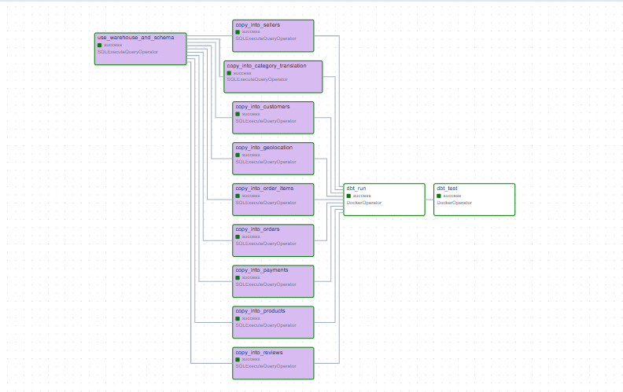

# Pipeline ELT Olist — Data Engineering Portfolio Project

Pipeline ELT cloud-natif, architecture **medallion (bronze / silver / gold)**, construit sur le dataset public [Olist Brazilian E-Commerce](https://www.kaggle.com/datasets/olistbr/brazilian-ecommerce) (Kaggle, 9 fichiers CSV, ~127 Mo, ~1,5M lignes).

Projet réalisé dans le cadre d'une candidature de stage PFE (Data Engineering / Data Cloud, 3e année ENSIAS).

> Structure de repo et style de README inspirés de [mindofyaseen/Snowflake-Project](https://github.com/mindofyaseen/Snowflake-Project) — dataset, modèles dbt et code métier entièrement personnels.

---

## Sommaire

- [Architecture](#architecture)
- [Stack technique](#stack-technique)
- [Structure du repo](#structure-du-repo)
- [Modèles dbt (couche gold)](#modèles-dbt-couche-gold)
- [Qualité des données](#qualité-des-données)
- [Instructions de reproduction](#instructions-de-reproduction)
- [Résultats](#résultats)

---

## Architecture

```
CSV Olist (Kaggle)
      │  upload_to_s3.py
      ▼
S3 — zone bronze (raw/)
      │  COPY INTO (stage externe)
      ▼
Snowflake RAW (bronze)
      │  dbt : staging + intermediate
      ▼
Snowflake STAGING (silver)
      │  dbt : marts
      ▼
Snowflake ANALYTICS (gold)
      │
      ▼
BI / Dashboards
```

- **Terraform** provisionne l'intégralité de l'infra : bucket S3, rôle IAM (storage integration Snowflake↔S3), warehouse, database, les 3 schémas et les rôles RBAC Snowflake.
- **Airflow** orchestre le chargement RAW (`COPY INTO`, parallélisé sur les 9 tables) puis déclenche `dbt run` et `dbt test`.
- **dbt** transforme RAW → STAGING (silver) → ANALYTICS (gold), avec 46 tests de qualité.

### DAG Airflow — exécution complète



`use_warehouse_and_schema` → 9× `copy_into_*` (parallélisés) → `dbt_run` → `dbt_test`, tous en succès.

---

## Stack technique

| Couche | Technologie | Rôle |
|---|---|---|
| Stockage brut | **AWS S3** | Data lake, zone bronze (CSV bruts) |
| Entrepôt | **Snowflake** | Warehouse cloud, bronze/silver/gold en schémas séparés |
| Transformation | **dbt** (dbt-snowflake) | SQL modulaire, tests, documentation |
| Orchestration | **Apache Airflow** | Enchaînement COPY INTO → dbt run → dbt test |
| Infrastructure as Code | **Terraform** | S3, IAM, warehouse/database/schémas/rôles Snowflake |
| Isolation dbt | **Docker** (`DockerOperator`) | dbt exécuté dans un conteneur dédié |
| Qualité de données | **dbt tests** + **dbt_expectations** | 46 tests automatisés |
| Langage | **Python**, **SQL**, **HCL** | Scripts d'ingestion, transformations, infra |

---

## Structure du repo

```
olist-elt-pipeline/
├── infra/terraform/
│   ├── modules/{s3, iam, snowflake}
│   └── environments/dev/
├── airflow/
│   ├── dags/olist_elt_pipeline_dag.py
│   ├── docker-compose.yaml
│   └── Dockerfile
├── dbt/
│   ├── Dockerfile
│   └── olist_dbt/
│       └── models/{staging, intermediate, marts}
├── scripts/
│   ├── upload_to_s3.py
│   └── snowflake_setup.sql
└── data/raw/   (CSV Olist, non versionnés)
```

---

## Modèles dbt (couche gold)

| Mart | Grain | Contenu |
|---|---|---|
| `mart_sales_performance` | mois × catégorie produit × état client | CA (GMV), nombre de commandes, panier moyen |
| `mart_delivery_performance` | mois × état client | délai de livraison réel vs estimé, taux de retard |
| `mart_customer_satisfaction` | mois | note moyenne, note en cas de retard vs à l'heure |

---

## Qualité des données

**46 tests dbt**, 100 % de succès, couvrant :

- unicité et non-nullité des clés (staging + intermediate)
- intégrité référentielle (`relationships` entre commandes, produits, vendeurs)
- cohérence métier (`accepted_values`, plages de valeurs via `dbt_expectations`)

---

## Instructions de reproduction

### Prérequis

- Compte AWS (Free Tier) et compte Snowflake (trial, édition Standard, même région que le bucket S3)
- Terraform ≥ 1.6, AWS CLI, Docker Desktop, Python 3.11+
- Dataset [Olist](https://www.kaggle.com/datasets/olistbr/brazilian-ecommerce) téléchargé dans `data/raw/`

### 1. Infrastructure (Terraform)

```bash
cd infra/terraform/environments/dev
cp terraform.tfvars.example terraform.tfvars
terraform init
terraform apply
```

### 2. Ingestion (S3)

```bash
pip install boto3
python scripts/upload_to_s3.py
```

### 3. Chargement RAW (Snowflake)

Exécuter `scripts/snowflake_setup.sql` dans Snowsight, ou laisser Airflow s'en charger.

### 4. Transformation (dbt)

```bash
cd dbt/olist_dbt
dbt deps
dbt run
dbt test
```

### 5. Orchestration (Airflow)

```bash
cd airflow
docker build -t olist-dbt:latest ../dbt
docker compose build
docker compose up airflow-init
docker compose up -d
```

Interface Airflow disponible en local, connexion Snowflake à créer dans **Admin → Connections** (`snowflake_default`), puis déclencher le DAG `olist_elt_pipeline`.

---

## Résultats

**Volumes chargés (zone bronze, conformes au dataset officiel Olist) :**

| Table | Lignes |
|---|---|
| orders | 99 441 |
| order_items | 112 650 |
| customers | 99 441 |
| products | 32 951 |
| payments | 103 886 |
| reviews | 99 224 |
| sellers | 3 095 |
| geolocation | 1 000 163 |
| category_translation | 71 |

**Exemple de sortie — `mart_sales_performance` :**

| order_month | product_category | customer_state | n_orders | gross_merchandise_value | avg_order_value |
|---|---|---|---|---|---|
| 2016-10-01 | furniture_decor | SP | 18 | 2217.76 | 123.21 |
| 2016-10-01 | perfumery | SP | 10 | 1689.80 | 168.98 |
| 2016-10-01 | health_beauty | RJ | 6 | 1584.75 | 264.13 |
